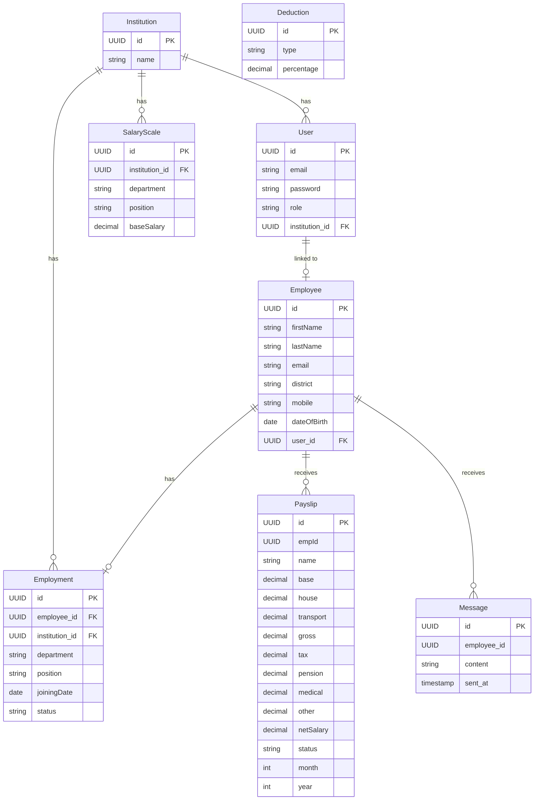

# Entity Relationship Diagram (ERD)

Here is the Entity Relationship Diagram for the complete multi-tenant Enterprise Payroll Management System.

```mermaid
erDiagram
    Institution {
        UUID id PK
        string name
    }
    User {
        UUID id PK
        string email
        string password
        string role
        UUID institution_id FK
    }
    Employee {
        UUID id PK
        string firstName
        string lastName
        string email
        string district
        string mobile
        date dateOfBirth
        UUID user_id FK
    }
    Employment {
        UUID id PK
        UUID employee_id FK
        UUID institution_id FK
        string department
        string position
        date joiningDate
        string status
    }
    SalaryScale {
        UUID id PK
        UUID institution_id FK
        string department
        string position
        decimal baseSalary
    }
    Deduction {
        UUID id PK
        string type
        decimal percentage
    }
    Payslip {
        UUID id PK
        UUID empId
        string name
        decimal base
        decimal house
        decimal transport
        decimal gross
        decimal tax
        decimal pension
        decimal medical
        decimal other
        decimal netSalary
        string status
        int month
        int year
    }
    Message {
        UUID id PK
        UUID employee_id
        string content
        timestamp sent_at
    }

    Institution ||--o{ User : "has"
    Institution ||--o{ Employment : "has"
    Institution ||--o{ SalaryScale : "has"
    User ||--o| Employee : "linked to"
    Employee ||--o| Employment : "has"
    Employee ||--o{ Payslip : "receives"
    Employee ||--o{ Message : "receives"
```
