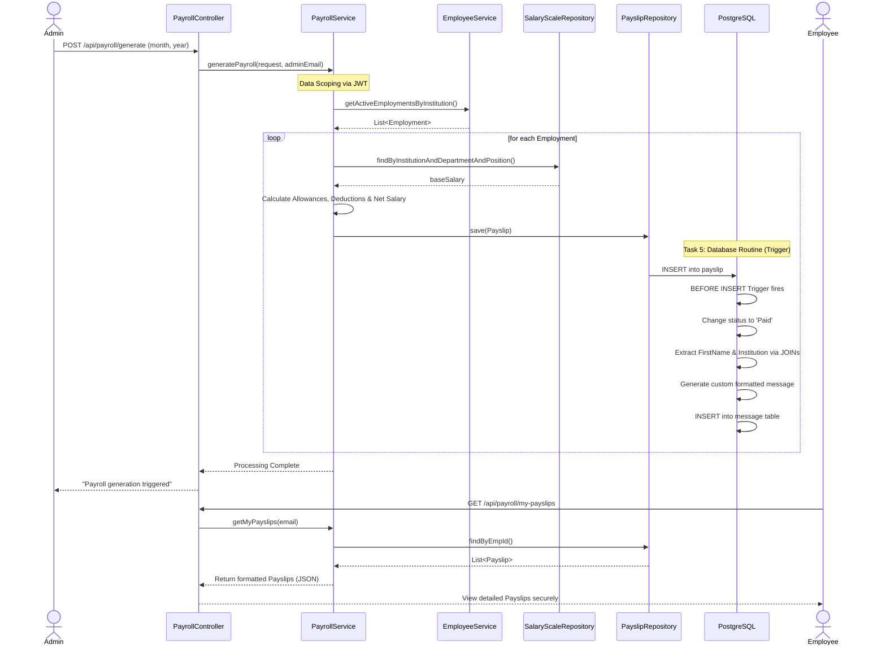

# Spring Boot Flow Diagram

Here is the Spring Boot architectural flow diagram showcasing the Payroll Generation logic and the Database Routine (Trigger).

```mermaid
sequenceDiagram
    actor Admin
    participant PC as PayrollController
    participant PS as PayrollService
    participant ES as EmployeeService
    participant SS as SalaryScaleRepository
    participant PR as PayslipRepository
    participant DB as PostgreSQL
    actor Employee

    Admin->>PC: POST /api/payroll/generate (month, year)
    PC->>PS: generatePayroll(request, adminEmail)
    
    note over PS: Data Scoping via JWT
    PS->>ES: getActiveEmploymentsByInstitution()
    ES-->>PS: List<Employment>
    
    loop for each Employment
        PS->>SS: findByInstitutionAndDepartmentAndPosition()
        SS-->>PS: baseSalary
        PS->>PS: Calculate Allowances, Deductions & Net Salary
        PS->>PR: save(Payslip)
        
        note over DB: Task 5: Database Routine (Trigger)
        PR->>DB: INSERT into payslip
        DB->>DB: BEFORE INSERT Trigger fires
        DB->>DB: Change status to 'Paid'
        DB->>DB: Extract FirstName & Institution via JOINs
        DB->>DB: Generate custom formatted message
        DB->>DB: INSERT into message table
    end
    
    PS-->>PC: Processing Complete
    PC-->>Admin: "Payroll generation triggered"

    Employee->>PC: GET /api/payroll/my-payslips
    PC->>PS: getMyPayslips(email)
    PS->>PR: findByEmpId()
    PR-->>PS: List<Payslip>
    PS-->>PC: Return formatted Payslips (JSON)
    PC-->>Employee: View detailed Payslips securely
```
